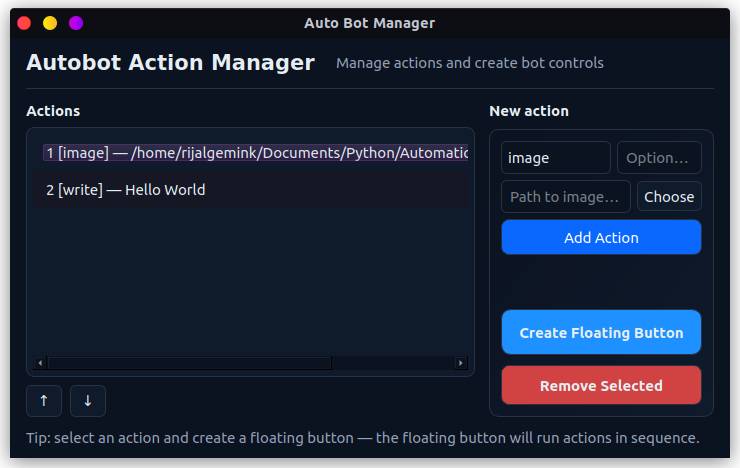

# Autobot Action Aplications (AAA)

Autobot Action Aplications (AAA) is a small cross‑platform utility to create lightweight floating controllers that execute sequential actions — image-based clicks and typed text — on your desktop. It provides a desktop UI to configure actions and spawn draggable floating buttons that run those actions in order.

Author: ArizalMuluk — https://github.com/ArizalMuluk

## Features
- Create named actions of two types:
  - image — locate an image on screen and click it (uses pyautogui / OpenCV)
  - write — type a text string
- Save and load actions to `actions.json`
- Spawn one or more draggable floating buttons to trigger action sequences
- Dark themed modern UI (PySide6)
- Runs on Linux and Windows (see notes below)

## Requirements
- Python 3.8+
- packages listed in `requirements.txt` (PySide6, pyautogui, pillow, mss, opencv-python, ...)

On Linux with X11, `scrot` may be required for screenshots. On Wayland, screenshot behavior varies.

## Quick install (recommended)
Run in project root:
```bash
python3 -m venv .venv
source .venv/bin/activate
pip install -r requirements.txt
```

If you use Linux (X11) and rely on pyautogui screenshots:
```bash
# Debian/Ubuntu
sudo apt install scrot
```

## Run
With virtualenv active:
```bash
python main.py
```

## Usage
1. Open the app.
2. Add actions (choose type, provide image path or text, give optional name).
3. Select an action in the list (you can reorder).
4. Click "Create Floating Button for Selected" — a draggable floating controller appears.
5. Press the floating button's Start option to run the configured action sequence.

## Tutorial
First, add the action you want to include. There are currently 2 action options (image and text). After adding actions and ensuring they are sufficient, press the "Create Floating Button" button.



Second, once the floating button appears, go to the target application, click the gear icon, and execute the actions using the start button (play symbol).


## Notes & Troubleshooting
- Image matching uses pyautogui.locateCenterOnScreen. For reliable "confidence" matching, install OpenCV (`opencv-python`).
- Wayland screenshot limitations: image matching may not work properly under Wayland; use X11/XWayland or an alternate screenshot backend.
- If locateOnScreen returns None, the image wasn't found — check path, scaling, and monitor/DPI settings.

## Storage
Actions are stored in `actions.json` at the project root. The file is read on startup and saved when you add/remove or reorder actions.

## Contributing
PRs and issues welcome. Keep changes focused and include tests where applicable.

## License
[MIT License](./LICENSE.md)

## Contact
GitHub: https://github.com/ArizalMuluk
Website: https://arzlfrds.my.id
